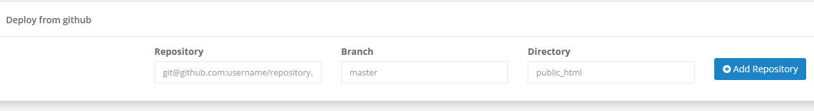
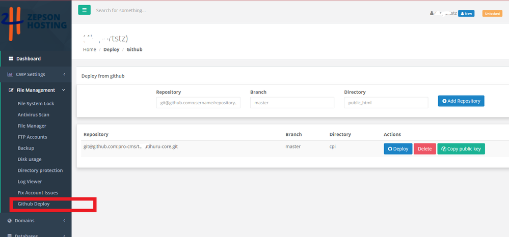

# CWP Module for Deploying Github Website

## Description

This module is designed to aid in the deployment of websites from GitHub to a CentOS Web Panel (CWP). It requires the user to enter their repository name, branch, and the directory to be added, which will be saved in their home directory as `deploydatabase.json`.

## Installation

1. Download the zip file from this repository and upload it to the root directory of your CWP installation.
2. Unzip the files.
3. Update the `/usr/local/cwpsrv/htdocs/resources/conf/user_panel/menuConf.php` file with the `menuConf.php` provided in the `services` folder.
4. In the User Account settings of your CWP panel, update the permissions for Features, Themes, and Languages for the specific user or account.

## Usage

After installation, go to your CWP User panel , Go to file manager select Github Deploy and navigate to the newly installed module. Here, enter your GitHub repository name, branch, and the directory that you want to add to your website.

The module will generate a private key for you to use as a deploy key on GitHub. Click on the 'Copy' button to copy this key.

Then, navigate to your GitHub repository and go to Settings -> Deploy keys. Paste the copied key here.

Once you've added the deploy key, your website files will be fetched from your GitHub repository and deployed to your CWP server.

## Contribution & Support

This module is open for contributions. If you find it useful, consider supporting the development through a sponsorship, or you can [BUY ME A COFFEE](https://www.buymeacoffee.com/novaprocms).

Current sponsor: Zepson Hosting ([zepsohost.com](https://www.zepsonhost.com))

GitHub: [pro-cms](https://github.com/pro-cms)

## Future Plans

We are working on adding webhook support to the module. Stay tuned for more updates.

